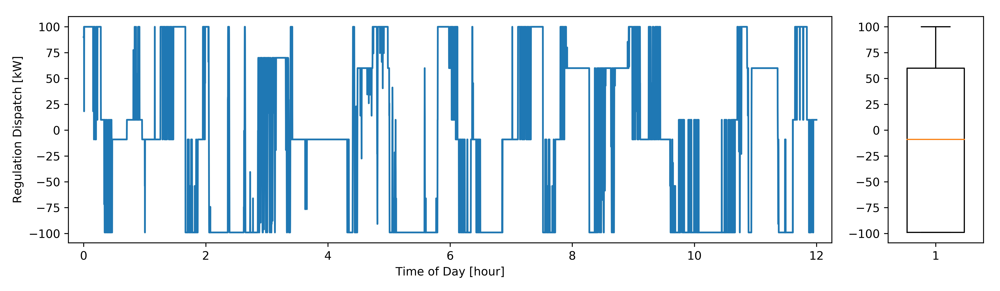

# SynAS
#### Synthetic Ancillary Service Generator
-------------------------------------------------------------------------

This package generates synthetic fast frequency regulation dispatches for simulation and emulation purposes.

## General
The balance of demand and supply in the electric power grid is a crucial element to grid reliability. While balancing is typically provided by conventional power plants, with spinning generators, distributed energy resources (DER) and especially electric vehicles (EVs) pose a great potential to provide such service. This project conducted a field demonstration at the [Los Angeles Air Force Base](https://eta.lbl.gov/news/article/58888/los-angeles-air-force-base-demo) (LA-AFB) where a fleet of mixed-use bi-directional EVs were actively participating in the [California Independent System Operator](http://www.caiso.com/Pages/default.aspx) (CAISO) market for frequency regulation. While participation in regulation markests is promising, a major drawback in designing control systems and assessing potential revenue is the lack of example frequency regulation signals. This project introduces an open-source dataset for 143 days of four-second regulation data, and the SynAS Python module to synthetically generate frequency regulation signals of arbitrary length.

The SynAS module can be used to generate fast frequency regulation dispatches in two modes:
* Batch Mode: Generates a single dataframe of synthetic dispatch of any length.
* Co-Simulaiton Mode: Allows to easily interface with co-simulation environments with a convenient `do_step` function which can be invoked at each timestep to provide the next dispatch datapoint.

The SynAS module was developed based on actual CAISO dispatch signals for stationary battery with a capacity of 100 MWh (100 MW). The synthetically generated profiles are statistically similar to the actual signals. Below is an example signal generated in the batch mode for twelve hours, in a four second timestep.

Further information can be found in the full project report listed in the [Cite](https://github.com/LBNL-ETA/SynAS#cite) section.

## Getting Started
The following link permits users to clone the source directory containing the [SynAS](https://github.com/LBNL-ETA/SynAS) package.

The package depends on external modules which can be installed from pypi with `pip install -r requirements.txt`.

## Example
To illustrate the SynAS functionality, example Jupyter notebooks can be found [here](examples).

[Batch Mode](examples/batch_mode.ipynb)

[Co-Simulation Mode](examples/cosimulation_mode.ipynb)

## License
Synthetic Ancillary Service Generator (SynAS) Copyright (c) 2020, The Regents of the University of California, through Lawrence Berkeley National Laboratory (subject to receipt of any required approvals from the U.S. Dept. of Energy) and the University of Applied Sciences Technikum Wien. All rights reserved.

If you have questions about your rights to use or distribute this software, please contact Berkeley Lab's Intellectual Property Office at IPO@lbl.gov.

NOTICE.  This Software was developed under funding from the U.S. Department of Energy and the U.S. Government consequently retains certain rights.  As such, the U.S. Government has been granted for itself and others acting on its behalf a paid-up, nonexclusive, irrevocable, worldwide license in the Software to reproduce, distribute copies to the public, prepare derivative works, and perform publicly and display publicly, and to permit others to do so.

## Cite
To cite the SynAS package, please use:

*Gehbauer, Christoph, Stosic, A. and Black, D. 2020. Synthetic CAISO Frequency Regulation Signal. The American Modelica Conference 2020.*
